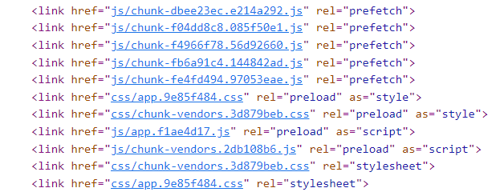

#### js加载优化
因为渲染引擎和js引擎不是同时进行的，所以提前引入js文件可能会造成页面阻塞，影响页面加载。因此script或link一般放到body后面引入或者会给script或link设置一些属性。
+ script:defer  
1、如果script标签设置了该属性，则浏览器会异步的下载该文件并且不会影响到后续DOM的渲染  
2、defer脚本会在DOM渲染完毕后，DOMContentLoaded事件调用前执行
+ script:async  
1、浏览器立即异步下载文件，下载完成会立即执行，此时会阻塞dom渲染，所以async的script最好不要操作dom。因为是下载完立即执行，不能保证多个加载时的先后顺序
+ link:preload  
1、会在父chunk下载时一起下载(加载后并不执行)，需要执行时再执行  
2、打包工具如(vue-cli，webpack需要自己配)一般会给第三方库、app的js、css包添加preload
+ link:prefetch  
1、资源将会在未来某个导航或者功能要用到，但是本资源的下载顺序权重比较低  
2、prefetch通常用于加速下一次导航，而不是本次的  
3、被标记为prefetch的资源，将会被浏览器在空闲时间加载  
4、打包工具如(vue-cli，webpack需要自己配)一般会给相关的js、css包添加prefetch  
 

#### 组件懒加载
1、vue中配合异步组件和import引入组件，其实vue路由和组件懒加载的原理都是监听到事件后再去加载对应的代码  
2、打包工具会将组件单独打包，只有当需要时才会加载  
3、缺点是当用户点击后再去加载，需要单独发起请求，要耗费一些时间。这时候就需要配合[js加载优化](./optimization.md#js加载优化)一起处理，比如使用prefetch，等浏览器空闲时自动加载组件
#### Web Worker
1、因为js引擎线程和ui渲染线程是互斥的，所以如果js存在大量计算，导致js引擎执行时间过长（一般浏览器刷新率为60赫兹，所以单次渲染为1/60s），就会阻塞ui渲染引擎  
2、Web Worker可以在后台开启新的线程，执行大量计算后再返回给主线程  
3、主线程和Web Worker线程可通过postmessage、onmessage传递和监听数据
#### 浏览器缓存
+ 强缓存  
1、浏览器直接从本地读取，不与服务器交互  
2、请求会返回200  
3、主要根据Expires和Cche-Control两个字段控制
+ 协商缓存  
1、浏览器发送请求到服务器，由服务器判断是否使用本地缓存  
2、如果命中缓存，则会返回304  
3、主要根据if-Modified-Since和Last-Modified、Etag和if-None-Match控制
#### gzip压缩
1、gzip压缩需要nginx配置开启gzip，打包的时候也要打包gzip包，打包工具可以进行配置  
2、缺点是由于开启gzip需要压缩本地文件，因此会增加打包时间
#### 按需引入
引入第三方模块时按需引入模块，打包工具会进行[treeSharking](/vite/treeSharking.md)，减小打包体积
#### 代码压缩
打包工具配置
#### CDN加速
jsDelivr提供npm或github资源的免费CDN加速服务。
#### 图片懒加载 
懒加载就是初始给图片一个1*1px图片的路径，当图片位置出现在视野中时再通过js替换图片的路径。
#### 精灵图
将多张图片合并到一张，这个主要是为了减少http请求
