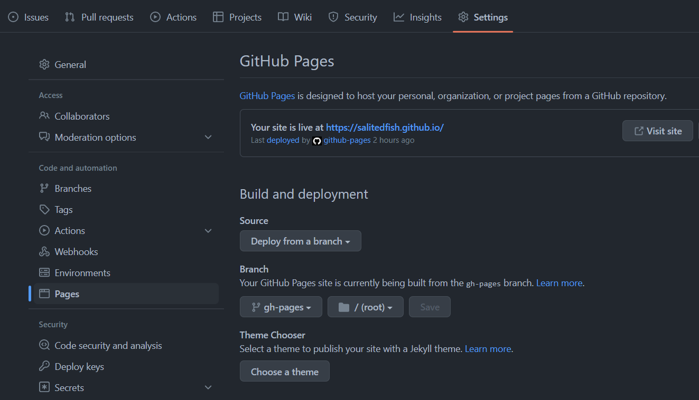

#### 简介
+ git page是通过github提供的服务器来部署的静态页面。
+ 将index.html放在git仓库指定目录中，就能通过特定地址访问该页面（默认为https://%username%.github.io/）。

#### 配置示例
+ 如果你的仓库地址是：https://github.com/%username%/%username%.github.io，则页面地址为：https://%username%.github.io/。  
+ 如果你的仓库地址是：https://github.com/%username%/%repository%，则页面地址为：https://%username%.github.io/%repository%。  
+ 具体index.html存放目录、分支等，可在github中配置,如下界面：

