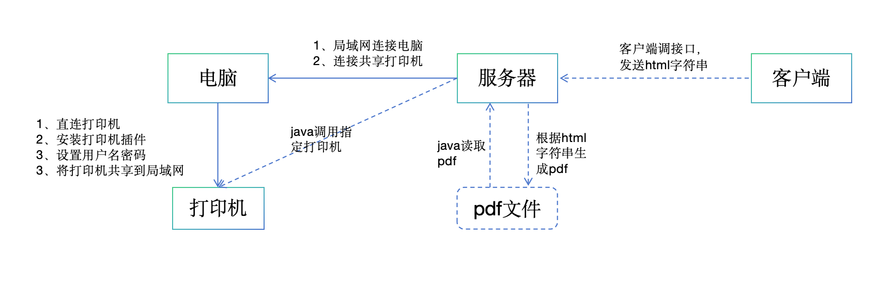

#### 基础思路

[参考地址](https://blog.csdn.net/m0_46267097/article/details/112609095)


#### java 示例

```java
import com.itextpdf.html2pdf.ConverterProperties;
import com.itextpdf.html2pdf.HtmlConverter;
import com.itextpdf.html2pdf.resolver.font.DefaultFontProvider;
import com.itextpdf.io.font.FontProgram;
import com.itextpdf.io.font.FontProgramFactory;
import com.itextpdf.kernel.geom.PageSize;
import com.itextpdf.kernel.pdf.PdfDocument;
import com.itextpdf.kernel.pdf.PdfWriter;
import com.itextpdf.layout.Document;
import com.itextpdf.layout.font.FontProvider;
import org.apache.pdfbox.pdmodel.PDDocument;
import org.apache.pdfbox.printing.PDFPageable;
import org.apache.pdfbox.printing.PDFPrintable;
import org.apache.pdfbox.printing.Scaling;

import javax.print.PrintService;
import java.awt.print.Book;
import java.awt.print.PageFormat;
import java.awt.print.Paper;
import java.awt.print.PrinterJob;
import java.io.File;
import java.io.FileOutputStream;
import java.io.OutputStream;

/**
 * 打印机相关工具类
 */
public class PrinterUtils {
    // 模板字符串
    private static String templateStr = "<div style=\"width: 6cm; height: 4cm;\"></div>";
    // 打印纸宽度英寸*72
    private static Integer pageWidth = 3 * 72;
    // 打印纸高度英寸*72
    private static Integer pageHeight = 2 * 72;
    // 打印机名称
//    private String printerName = "\\\\192.168.0.17\\ZDesigner GX430t";
    private static String printerName = "ZDesigner GX430t (副本 1)";
    // 根据html字符串生成的pdf地址
    private static final String pdfPath = "D:\\lscf\\test.pdf";
    // 字体文件存放地址
    private static final String fontPath = System.getProperty("user.dir") + "\\ruoyi-common\\src\\main\\resources\\fonts\\msyhbd.ttc,0";
//    private static final String fontPath = "D:\\lscf\\msyhbd.ttc,0";

    /**
     * 打印入口
     * @param printStr
     * @return
     * @throws Exception
     */
    public static void print(String printStr) throws Exception {
        // html字符串转pdf
        PrinterUtils.htmlStrToPdf(printStr);
        // 根据打印机名称和pdf路径打印pdf
        PrinterUtils.printPdf(PrinterUtils.pdfPath);
    }
    public static void print(String printStr, String printerName) throws Exception {
        PrinterUtils.setPrinterName(printerName);
        PrinterUtils.print(printStr);
    }


    /**
     * html字符串转化为pdf
     * @param htmlStr
     * @throws Exception
     */
    private static void htmlStrToPdf (String htmlStr) throws Exception {
        // 配置字体文件
        ConverterProperties converterProperties = new ConverterProperties();
        FontProvider fontProvider = new DefaultFontProvider();
        FontProgram fontProgram = FontProgramFactory.createFont(PrinterUtils.fontPath);
        fontProvider.addFont(fontProgram);
        converterProperties.setFontProvider(fontProvider);
        // 创建pdf
        OutputStream fileOutputStream = new FileOutputStream(PrinterUtils.pdfPath);
        PdfWriter pdfWriter = new PdfWriter(fileOutputStream);
        // 创建页面
        PdfDocument doc = new PdfDocument(pdfWriter);
        PageSize pageSize = new PageSize( PrinterUtils.pageWidth * 1.38f,PrinterUtils.pageHeight * 1.38f);
        doc.setDefaultPageSize(pageSize);
        // html转pdf
        Document document = HtmlConverter.convertToDocument(htmlStr,doc,converterProperties);
        document.getRenderer().close();
        document.close();
    }

    /**
     * 开始打印pdf
     * @param pdfPath
     * @return
     * @throws Exception
     */
    public static void printPdf(String pdfPath) throws Exception {
        File file = new File(pdfPath);
        PDDocument document = PDDocument.load(file);
        // 根据打印机名称获取打印机
        PrinterJob job = PrinterUtils.getPrintServiceByName(PrinterUtils.printerName);
        // 设置打印样式
        PrinterUtils.setPageStyle(document, job);
        // 开始打印
        job.print();
    }
    public static void printPdf(String pdfPath, String printerName) throws Exception {
        PrinterUtils.setPrinterName(printerName);
        PrinterUtils.printPdf(pdfPath);
    }

    /**
     * 根据打印机名称获取打印机服务
     * @param printerName
     * @return
     * @throws Exception
     */
    private static PrinterJob getPrintServiceByName(String printerName) throws Exception{
        PrinterJob job = PrinterJob.getPrinterJob();
        // 遍历查询打印机名称
        boolean flag = false;
        for (PrintService ps : PrinterUtils.getPrinterServices()) {
            String psName = ps.toString();
            System.out.println("搜索到打印机名：" + psName);
            // 选用指定打印机，需要精确查询打印机就用equals，模糊查询用contains
            if (psName.contains(printerName)) {
                flag = true;
                job.setPrintService(ps);
                break;
            }
        }
        if(!flag){
            throw new RuntimeException("打印失败，未找到名称为" + printerName + "的打印机，请检查。");
        }
        return job;
    }

    /**
     * 设置打印参数
     * @param document
     * @param job
     */
    private static void setPageStyle(PDDocument document, PrinterJob job) {
        job.setPageable(new PDFPageable(document));
        Paper paper = new Paper();
        // 设置打印纸张大小
        paper.setSize(PrinterUtils.pageWidth,PrinterUtils.pageHeight);
        // 设置边距，单位是像素，10mm边距，对应 28px
        int marginLeft = -14;
        int marginRight = -14;
        int marginTop = -14;
        int marginBottom = -14;
        // 设置打印位置 坐标
        paper.setImageableArea(marginLeft, marginRight, PrinterUtils.pageWidth - (marginLeft + marginRight), PrinterUtils.pageHeight - (marginTop + marginBottom));

        PageFormat pageFormat = new PageFormat();
        pageFormat.setPaper(paper);
        Book book = new Book();
        // 设置一些属性 是否缩放 打印张数等
        book.append(new PDFPrintable(document, Scaling.SCALE_TO_FIT), pageFormat, 1);
        job.setPageable(book);
    }

    /**
     * 设置打印机名称
     * @param name
     */
    public static void setPrinterName(String name) {
        PrinterUtils.printerName = name;
    }

    /**
     * 获取打印机列表
     * @return
     */
    public static PrintService[] getPrinterServices() {
        return PrinterJob.lookupPrintServices();
    }

}

```

#### maven 依赖

```xml
        <!-- pdfBox-->
        <dependency>
            <groupId>org.apache.pdfbox</groupId>
            <artifactId>pdfbox</artifactId>
            <version>2.0.21</version>
        </dependency>

        <!-- itextpdf-->
        <dependency>
            <groupId>com.itextpdf</groupId>
            <artifactId>itextpdf</artifactId>
            <version>5.5.13</version>
        </dependency>
        <dependency>
            <groupId>com.itextpdf</groupId>
            <artifactId>itext-asian</artifactId>
            <version>5.2.0</version>
        </dependency>
        <dependency>
            <groupId>com.itextpdf</groupId>
            <artifactId>kernel</artifactId>
            <version>7.1.14</version>
        </dependency>
        <dependency>
            <groupId>com.itextpdf</groupId>
            <artifactId>html2pdf</artifactId>
            <version>3.0.3</version>
        </dependency>

```
