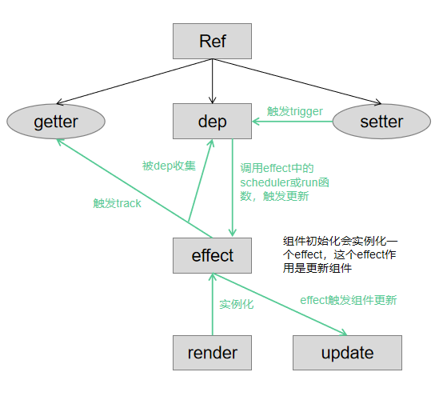
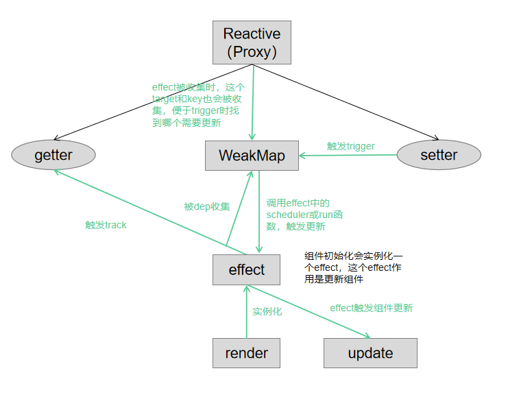
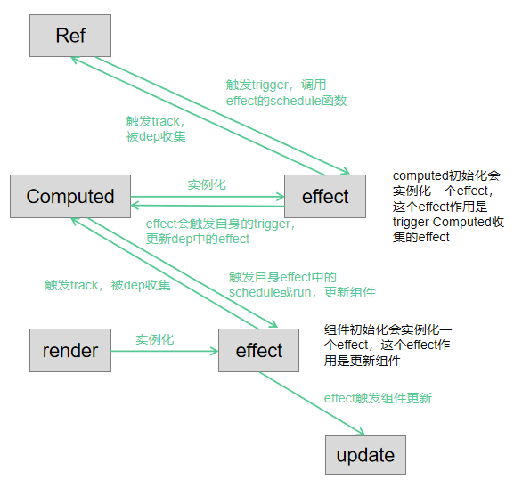
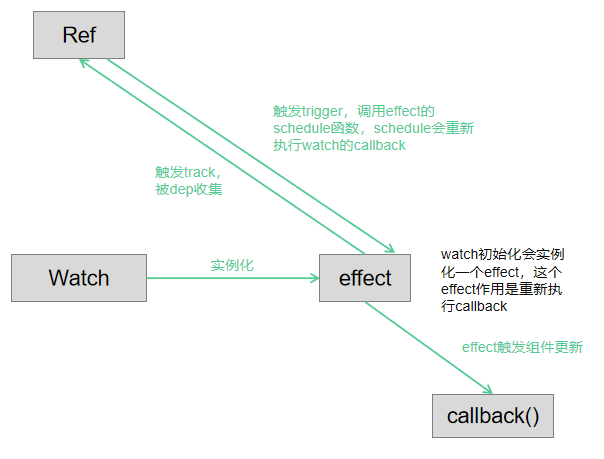

### Effect
+ effect是响应式中很重要的部分，主要作用是保存触发依赖收集和触发依赖更新的方法
+ 组件初始化时会实例化一个effect，被响应式数据收集，当响应式数据更新时，则调用effect上的scheduler函数或run函数，触发组件更新
+ computed也会实例化一个effect，这个主要用来被computed依赖的响应式数据收集，和trigger computed自身所收集的effect
```ts
export class ReactiveEffect<T = any> {
  active = true
  deps: Dep[] = []
  parent: ReactiveEffect | undefined = undefined

  computed?: ComputedRefImpl<T>

  allowRecurse?: boolean

  private deferStop?: boolean

  onStop?: () => void
  onTrack?: (event: DebuggerEvent) => void
  onTrigger?: (event: DebuggerEvent) => void

  constructor(
    public fn: () => T,
    public scheduler: EffectScheduler | null = null,
    scope?: EffectScope
  ) {
    recordEffectScope(this, scope)
  }

  run() {
    if (!this.active) {
      return this.fn()
    }
    let parent: ReactiveEffect | undefined = activeEffect
    let lastShouldTrack = shouldTrack
    while (parent) {
      if (parent === this) {
        return
      }
      parent = parent.parent
    }
    try {
      this.parent = activeEffect
      activeEffect = this
      shouldTrack = true

      trackOpBit = 1 << ++effectTrackDepth

      if (effectTrackDepth <= maxMarkerBits) {
        initDepMarkers(this)
      } else {
        cleanupEffect(this)
      }
      return this.fn()
    } finally {
      if (effectTrackDepth <= maxMarkerBits) {
        finalizeDepMarkers(this)
      }

      trackOpBit = 1 << --effectTrackDepth

      activeEffect = this.parent
      shouldTrack = lastShouldTrack
      this.parent = undefined

      if (this.deferStop) {
        this.stop()
      }
    }
  }

  stop() {
    if (activeEffect === this) {
      this.deferStop = true
    } else if (this.active) {
      cleanupEffect(this)
      if (this.onStop) {
        this.onStop()
      }
      this.active = false
    }
  }
}
```

### Ref
+ 包装成一个对象，对象中有dep、get value、set value
+ 在render时，如果使用到此Ref会创建一个effect提供给此Ref收集

```ts
class RefImpl<T> {
  private _value: T
  private _rawValue: T

  public dep?: Dep = undefined
  public readonly __v_isRef = true

  constructor(value: T, public readonly __v_isShallow: boolean) {
    this._rawValue = __v_isShallow ? value : toRaw(value)
    this._value = __v_isShallow ? value : toReactive(value)
  }

  get value() {
    trackRefValue(this)
    return this._value
  }

  set value(newVal) {
    newVal = this.__v_isShallow ? newVal : toRaw(newVal)
    if (hasChanged(newVal, this._rawValue)) {
      this._rawValue = newVal
      this._value = this.__v_isShallow ? newVal : toReactive(newVal)
      triggerRefValue(this, newVal)
    }
  }
}
```

### Reactive
+ 使用proxy，在get和set时进行track和trigger
+ 在render时，如果使用到此Reactive会创建一个effect提供给此Reactive收集

```ts
function createGetter(isReadonly = false, shallow = false) {
  return function get(target: Target, key: string | symbol, receiver: object) {
    const res = Reflect.get(target, key, receiver)
    if (!isReadonly) {
      track(target, TrackOpTypes.GET, key)
    }
    if (shallow) {
      return res
    }
    if (isRef(res)) {
      return targetIsArray && isIntegerKey(key) ? res : res.value
    }
    if (isObject(res)) {
      return isReadonly ? readonly(res) : reactive(res)
    }
    return res
  }
}

function createSetter(shallow = false) {
  return function set(
    target: object,
    key: string | symbol,
    value: unknown,
    receiver: object
  ): boolean {
    let oldValue = (target as any)[key]
    const hadKey =
      isArray(target) && isIntegerKey(key)
        ? Number(key) < target.length
        : hasOwn(target, key)
    const result = Reflect.set(target, key, value, receiver)
    if (target === toRaw(receiver)) {
      if (!hadKey) {
        trigger(target, TriggerOpTypes.ADD, key, value)
      } else if (hasChanged(value, oldValue)) {
        trigger(target, TriggerOpTypes.SET, key, value, oldValue)
      }
    }
    return result
  }
}

export const mutableHandlers: ProxyHandler<object> = {
  get: createGetter(),
  set: createSetter,
}
```

### Computed
+ computed实际上进行了两层依赖收集，一个是computed自身的effect，一个是使用computed时产生的effect
+ computed实例化的时候并没有触发依赖收集，当使用computed时才会触发两层依赖收集

```ts
export class ComputedRefImpl<T> {
  public dep?: Dep = undefined

  private _value!: T
  public readonly effect: ReactiveEffect<T>

  public readonly __v_isRef = true
  public readonly [ReactiveFlags.IS_READONLY]: boolean = false

  public _dirty = true
  public _cacheable: boolean

  constructor(
    getter: ComputedGetter<T>,
    private readonly _setter: ComputedSetter<T>,
    isReadonly: boolean,
    isSSR: boolean
  ) {
    this.effect = new ReactiveEffect(getter, () => {
      if (!this._dirty) {
        this._dirty = true
        triggerRefValue(this)
      }
    })
    this.effect.computed = this
    this.effect.active = this._cacheable = !isSSR
    this[ReactiveFlags.IS_READONLY] = isReadonly
  }

  get value() {
    const self = toRaw(this)
    trackRefValue(self)
    if (self._dirty || !self._cacheable) {
      self._dirty = false
      //只有使用computed时才第一次触发依赖收集
      self._value = self.effect.run()!
    }
    return self._value
  }

  set value(newValue: T) {
    this._setter(newValue)
  }
}
```

### Watch
+ Watch实际上在，使用时就生成了一个effect，并执行了effect中的run，run中会使用响应式数据，并触发依赖收集，响应式数据改变时，就会触发此effect中的scheduler，并执行callback


```ts
function doWatch(
  source: WatchSource | WatchSource[] | WatchEffect | object,
  cb: WatchCallback | null,
  { immediate, deep, flush, onTrack, onTrigger }: WatchOptions = EMPTY_OBJ
): WatchStopHandle {

  const instance = currentInstance
  let getter: () => any
  
  // 这里给getter赋值，getter会传给effect的run，执行run会执行getter，会触发响应式数据的依赖收集
  if (isRef(source)) {
    getter = () => source.value
  } //...源码还做了其他类型的判断，这里就只用ref

  if (cb && deep) {
    const baseGetter = getter
    getter = () => traverse(baseGetter())
  }

  let cleanup: () => void
  let onCleanup: OnCleanup = (fn: () => void) => {
    cleanup = effect.onStop = () => {
      callWithErrorHandling(fn, instance, ErrorCodes.WATCH_CLEANUP)
    }
  }

  let oldValue = INITIAL_WATCHER_VALUE
  const job: SchedulerJob = () => {
    if (cb) {
      const newValue = effect.run()
      if (cleanup) {
        cleanup()
      }
      // 调度函数主要就是执行cb，这里可以简化的看出cb()
      callWithAsyncErrorHandling(cb, instance, ErrorCodes.WATCH_CALLBACK, [
        newValue,
        oldValue === INITIAL_WATCHER_VALUE ? undefined : oldValue,
        onCleanup
      ])
      oldValue = newValue
    } else {
      effect.run()
    }
  }

  job.allowRecurse = !!cb

  let scheduler: EffectScheduler
  scheduler = job as any

  const effect = new ReactiveEffect(getter, scheduler)

  if (cb) {
    oldValue = effect.run()
  } 

  return () => {
    effect.stop()
    if (instance && instance.scope) {
      remove(instance.scope.effects!, effect)
    }
  }
}
```
### NextTick
+ nextTick分两种情况，如果没数据需要更新，则直接Promise.then。如果有队列有数据需要更新(render里生成的effect在schedule执行时会调用queueJob添加更新队列)，则更新完后Promise.then
```ts
const resolvedPromise = Promise.resolve() as Promise<any>
let currentFlushPromise: Promise<void> | null = null

// 如果有更新队列，则currentFlushPromise会被赋值，等flushJobs执行完再then
function queueFlush() {
  if (!isFlushing && !isFlushPending) {
    isFlushPending = true
    currentFlushPromise = resolvedPromise.then(flushJobs)
  }
}

export function nextTick<T = void>(
  this: T,
  fn?: (this: T) => void
): Promise<void> {
  const p = currentFlushPromise || resolvedPromise
  return fn ? p.then(this ? fn.bind(this) : fn) : p
}
```